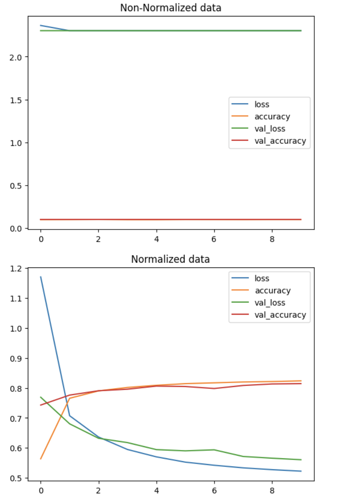
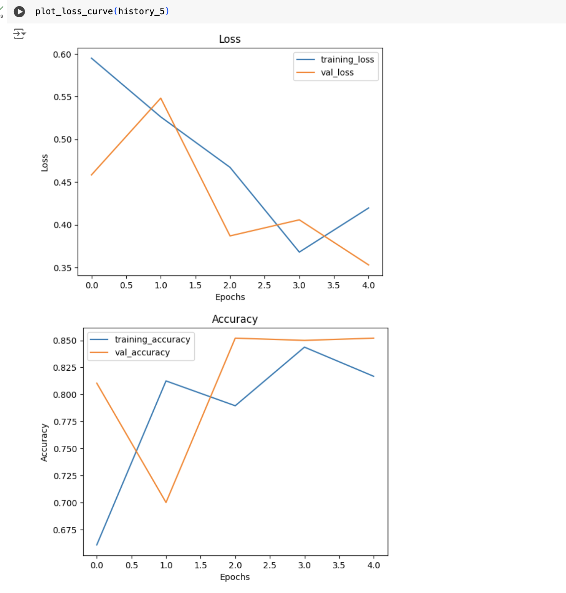
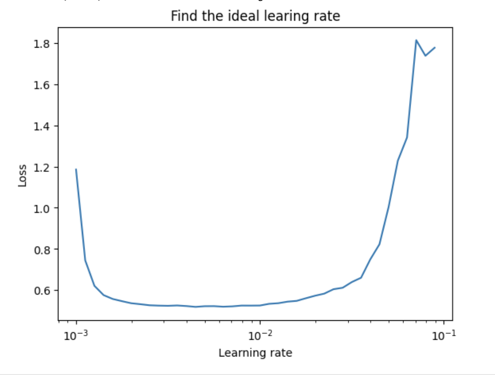
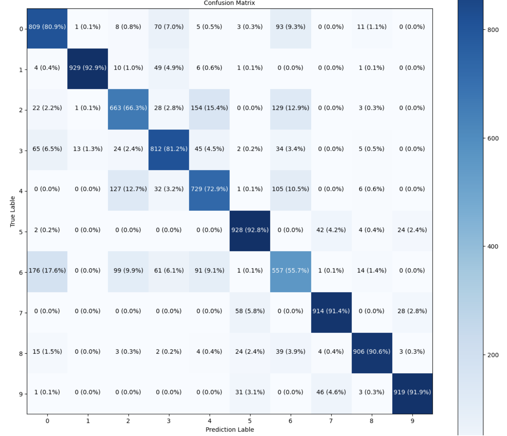
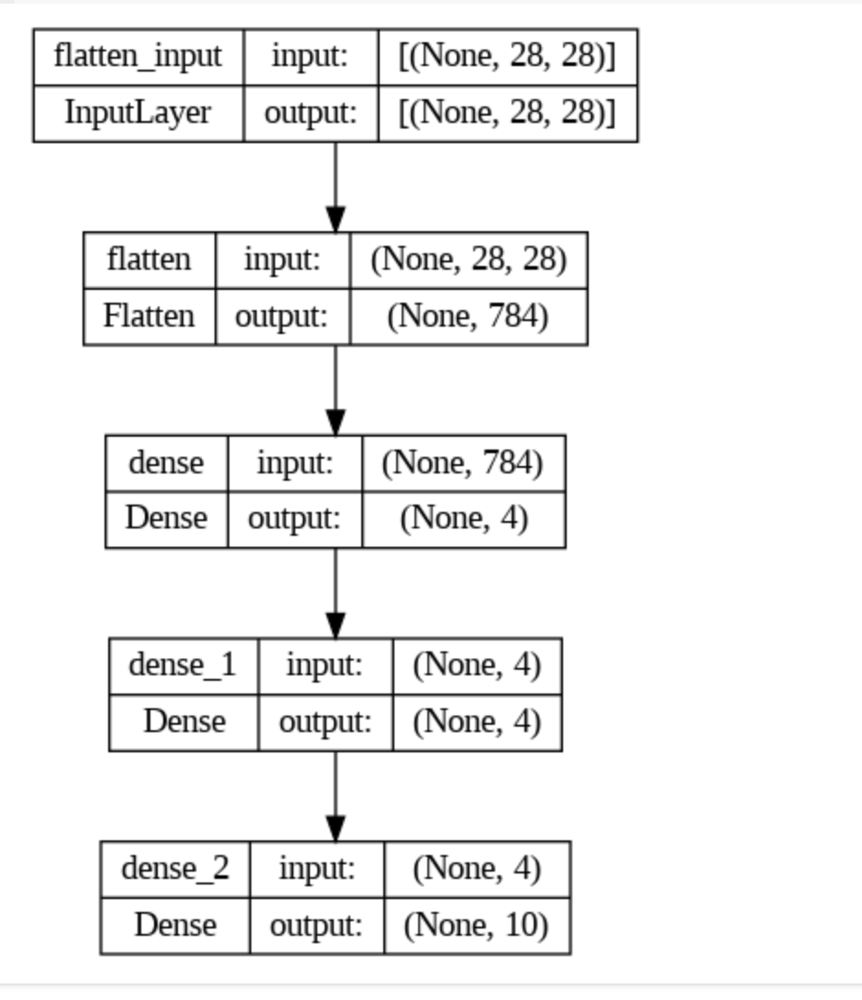

# 1. Linear and Non-liear
```buildoutcfg
linear = straigh line 
non-lenear = non straight line
```
# 2 NORMALIZE & STANDARDIZE DATA
Nural network prefer to have data in numarical form as well as scaled/normalized (i.e. number between 0 and 1)
## 2.1 Divide the train/test data with the max value
Get the min max value in the train dataset

    train_data.min(), train_data.max()

Divide it by the max value 
```buildoutcfg
train_data_norm= train_data /255.0
test_data_norm= test_data /255.0
```

Check how fast normalize data improve then non-normalize data
```buildoutcfg
import pandas as pd
# plot nor normalized data
pd.DataFrame(non_norm_history.history).plot(title='Non-Normalized data')

# plot  normalized data
pd.DataFrame(norm_history.history).plot(title='Normalized data')
```


🔑 Note: The same model with even slightly different data can produce dramatically different results. So when you're comparing models, it's important to make sure you're comparing them on the same criteria (e.g. same architecture but different data or same data but different architecture).

# 3. ACTIVATION FUNCTION'S 
## 3.1 Relu
    relu = max(X, 0) --> all negative values are set to 0
```buildoutcfg
def relu(X):
  return tf.maximum(0, X)
```
## 3.2 Sigmoid
    sigmoid = 1 / (1 + exp(-x))
```buildoutcfg
def sigmoid(x):
  return 1 / (1 + tf.exp(-x))
```
## What activation functions to use???

```buildoutcfg
For binary use Sigmoid
For multiclass softmax is better
```
# 4. HISTORY OF A MODEL
```buildoutcfg
history = model_8.fit(X_train, y_train, epochs=25)
```
## 4.1 Plot the loss curve
```
pd.DataFrame(history.history).plot()
plt.title("Model_8 loss curve")
```
## 4.2 Plot training and validation curve seperately
```buildoutcfg
def plot_loss_curve(history):
  '''
  Returns separate loss curves for training and validation metrics.
  '''
  loss = history.history['loss']
  val_loss = history.history['val_loss']

  accuracy = history.history['accuracy']
  val_accuracy = history.history['val_accuracy']

  epoches = range(len(history.history['loss']))

  # Plot loss
  plt.plot(epoches, loss, label='training_loss')
  plt.plot(epoches, val_loss, label='val_loss')
  plt.title('Loss')
  plt.xlabel('Epochs')
  plt.ylabel('Loss')
  plt.legend()


  # Plot accuracy
  plt.figure() ## Everytime want to create a new figure use it 
  plt.plot(epoches, accuracy, label='training_accuracy')
  plt.plot(epoches, val_accuracy, label='val_accuracy')
  plt.title('Accuracy')
  plt.xlabel('Epochs')
  plt.ylabel('Accuracy')
  plt.legend()
```
### Loass and Accuracy  curve
 When models VALIDATION LOSS starts to increase its likely that OVERFITTING the training dataset,  that means its learning the training data TOO WELL and thus the models ability to generalise the unseen data is DIMINISHED 


# 5. LEARNING RATE ADJUSTMENT
## callback - Method to find the best learning rate
### Change learning rate and apply to the optimizer
```buildoutcfg
# Create learning rate callback
lr_scheduler=tf.keras.callbacks.LearningRateScheduler(lambda epoch: 1e-4 * 10**(epoch/20))

# Fit the model lwith callback 
history_9 = model_9.fit(X_train, y_train, epochs=100, callbacks=[lr_scheduler])
```

### Checkout the history , check when the loss decreases the fastes 
```buildoutcfg
pd.DataFrame(history_9.history).plot(figsize=(10,7), xlabel='epochs')
```

### plot learning rate vs loss
```buildoutcfg
# loss is decreased at around cpoch 35 to 40 , ceck what was the learning rate approximately that time
lrs = 1e-4 * (10 ** (tf.range(100)/20))
plt.figure(figsize=(10,7))
plt.semilogx(lrs, history_9.history['loss'])
plt.xlabel('Learning rate')
plt.ylabel('Loss')
plt.title('Learning rate vs Loss')
```
### Learning rate curve
Check where the curve is going down to the max, then go back littlebit and consider it for the learning rate
The defaulr paramet of learing rate is 10**-3, which is mostly always observed to be the ideal learning rate


### Typical learing rates are 
```buildoutcfg
10**0, 10**-1, 10**-2, 10**-3, 1e-4
# But mostly the default laues set with the Optimizers are good enough
```


# 6. MULTICLASS CLASSIFICATION 

## IMAGE classificaton Example 

### Show image / plot image
```buildoutcfg
plt.imshow(train_data[7])
```
### choose image with lable
```buildoutcfg
index_of_choice=17
plt.imshow(train_data[index_of_choice], cmap=plt.cm.binary)
plt.title(class_names[train_labels[index_of_choice]])
```
### Random multiple images with label
```buildoutcfg
# plot multiple random images with label
import random

plt.figure(figsize=(10,10))
for i in range(4):
  ax = plt.subplot(2 ,2, i+1)
  rand_index = random.choice(range(len(train_data)))
  plt.imshow(train_data[rand_index], cmap=plt.cm.binary)
  plt.title(class_names[train_labels[rand_index]])
  plt.axis(False)
```

### Use of loss function in multiclass classification
#### 1. CategoricalCrossentropy - 
    this expectes labels to be in "one hot encoded"

Example: 
```buildoutcfg
model_11.compile(
    loss=tf.keras.losses.CategoricalCrossentropy(),
    optimizer=tf.keras.optimizers.Adam(),
    metrics=['accuracy']
)

non_norm_history=model_11.fit(train_data, 
                              tf.one_hot(train_labels, depth=10), 
                              epochs=10,
                              validation_data=(test_data, tf.one_hot(test_labels, depth=10)))
```
#### 2. SaprseCategoricalCrossentropy - 
    We can use it for multiple class labels are in integer form

Example: 
```buildoutcfg
model_11.compile(
    loss=tf.keras.losses.SparseCategoricalCrossentropy(),
    optimizer=tf.keras.optimizers.Adam(),
    metrics=['accuracy']
)


# Fit the data
non_norm_history=model_11.fit(train_data, 
                              train_labels, 
                              epochs=10,
                              validation_data=(test_data, test_labels))
```


#6. SOME REUSABLE FUNCTIONS 
## 6.1 Plot decessio boundary 
### Sample Code for 'Plots the decision boundary created by a model predicting on X.
```
import numpy as np

def plot_decision_boundary(model, X, y):
  """
  Plots the decision boundary created by a model predicting on X.
  This function has been adapted from two phenomenal resources:
   1. CS231n - https://cs231n.github.io/neural-networks-case-study/
   2. Made with ML basics - https://github.com/GokuMohandas/MadeWithML/blob/main/notebooks/08_Neural_Networks.ipynb
  """
  # Define the axis boundaries of the plot and create a meshgrid
  x_min, x_max = X[:, 0].min() - 0.1, X[:, 0].max() + 0.1
  y_min, y_max = X[:, 1].min() - 0.1, X[:, 1].max() + 0.1
  xx, yy = np.meshgrid(np.linspace(x_min, x_max, 100),
                       np.linspace(y_min, y_max, 100))

  # Create X values (we're going to predict on all of these)
  x_in = np.c_[xx.ravel(), yy.ravel()] # stack 2D arrays together: https://numpy.org/devdocs/reference/generated/numpy.c_.html

  # Make predictions using the trained model
  y_pred = model.predict(x_in)

  # Check for multi-class
  if model.output_shape[-1] > 1: # checks the final dimension of the model's output shape, if this is > (greater than) 1, it's multi-class
    print("doing multiclass classification...")
    # We have to reshape our predictions to get them ready for plotting
    y_pred = np.argmax(y_pred, axis=1).reshape(xx.shape)
  else:
    print("doing binary classifcation...")
    y_pred = np.round(np.max(y_pred, axis=1)).reshape(xx.shape)

  # Plot decision boundary
  plt.contourf(xx, yy, y_pred, cmap=plt.cm.RdYlBu, alpha=0.7)
  plt.scatter(X[:, 0], X[:, 1], c=y, s=40, cmap=plt.cm.RdYlBu)
  plt.xlim(xx.min(), xx.max())
  plt.ylim(yy.min(), yy.max())
```
###Plot decission boundary Training and test data 
```buildoutcfg
plt.figure(figsize=(12,6))
plt.subplot(1, 2, 1)
plt.title('Training Data')
plot_decision_boundary(model=model_10, X=X_train, y=y_train)
plt.subplot(1, 2, 2)
plt.title('Test data')
plot_decision_boundary(model=model_10, X=X_test, y=y_test)
plt.show()
```


## 6.2 CONFUSION MATRIX 
Visualize the y_true and y_pred and check how much the model was confused during prediction across the classes

```buildoutcfg
# Create a fucntion for confusion metrics 

import itertools
from sklearn.metrics import confusion_matrix 

figsize=(10, 10)

def generate_confusion_matrix(y_true, y_pred, classes=None, figsize=(10, 10), text_size=15): 

  # Create confusion matrix
  # cm=confusion_matrix(y_test, tf.round(y_pred))
  cm=confusion_matrix(y_true, y_pred)
  cm_norm = cm.astype('float') / cm.sum(axis=1)[:, np.newaxis]
  n_classes = cm.shape[0]

  # Pretyfy it
  fig, ax = plt.subplots(figsize=figsize)
  # Create matrix plot
  cax = ax.matshow(cm, cmap=plt.cm.Blues)
  fig.colorbar(cax)

  labels = np.arange(cm.shape[0])
  if classes:
    lables = classes
  

  # Lable the axis
  ax.set(title='Confusion Matrix',
        xlabel='Prediction Lable',
        ylabel='True Lable' ,
        xticks=np.arange(n_classes),
        yticks=np.arange(n_classes),
        xticklabels=labels,
        yticklabels=labels,
        )

  # Set x-axis labels to bottom
  ax.xaxis.set_label_position("bottom")
  ax.xaxis.tick_bottom()

  # Adjust label size
  ax.xaxis.label.set_size(text_size)
  ax.yaxis.label.set_size(text_size)
  ax.title.set_size(text_size)


  # Set threshold for different colours
  threshold = (cm.max() + cm.min()) / 2.


  # Plot the text on each cell
  for i, j in itertools.product(range(cm.shape[0]), range(cm.shape[1])):
    plt.text(j, i, f"{cm[i, j]} ({cm_norm[i, j]*100:.1f}%)",
            horizontalalignment="center",
            color="white" if cm[i, j] > threshold else "black",
            size=text_size)
```




## 6.3 Plot random image with predictel and true labels

### Functionise the random image plotting agains prediction 
```buildoutcfg
# Plot random image with predictel and true labels

import random

def plot_random_image(model, images, true_labels, classes):
  # set the random image
  i = random.randint(0, len(images))

  # Create prediction and target 
  target_image = images[i]
  pred_probs = model.predict(target_image.reshape(1, 28, 28))
  pred_label = classes[pred_probs.argmax()]
  true_label = classes[true_labels[i]]

  # plot the image
  plt.imshow(target_image, cmap=plt.cm.binary)

  # Change the colour of the title depending on prediction is correct or not
  if pred_label == true_label:
      color = "green"
  else:
    color = "red"

 # Add xlabel information (prediction/true label)
  plt.xlabel("Pred: {} {:2.0f}% (True: {})".format(pred_label,
                                                   100*tf.reduce_max(pred_probs),
                                                   true_label),
             color=color) # set the color to green or red
```
### Checkout random image and prediction 
```buildoutcfg
plot_random_image(model=model_14,
                  images=test_data_norm,
                  true_labels=test_labels,
                  classes=class_names)
```

## 6.4 Visualize the deep learning model 

### Find layers of our most recent model
```buildoutcfg
model_14.layers

# Extract a particular layer 
model_14.layers[1]

# Get patterns of a layer in our network 
weights, biases = model_14.layers[1].get_weights()

# Shape 
weights, weights.shape

# (784, 4)) , 748 is the number from flatten layer, 4 is the hidden unit from first dense layer 
# weight mztrix has 4 numbers that it start to learn and adjust in 748 numbers
# Initially it gives weight with random numbers (glorot_uniform )

model_14.summary()

# Now lets chekcout bias vecrot
# every hiden unint has one bias number , 
biases, biases.shape
```


```buildoutcfg
from tensorflow.keras.utils import plot_model 
plot_model(model_14, show_shapes=True)
```



# Resources:
https://ml-cheatsheet.readthedocs.io/en/latest/activation_functions.html#linear

